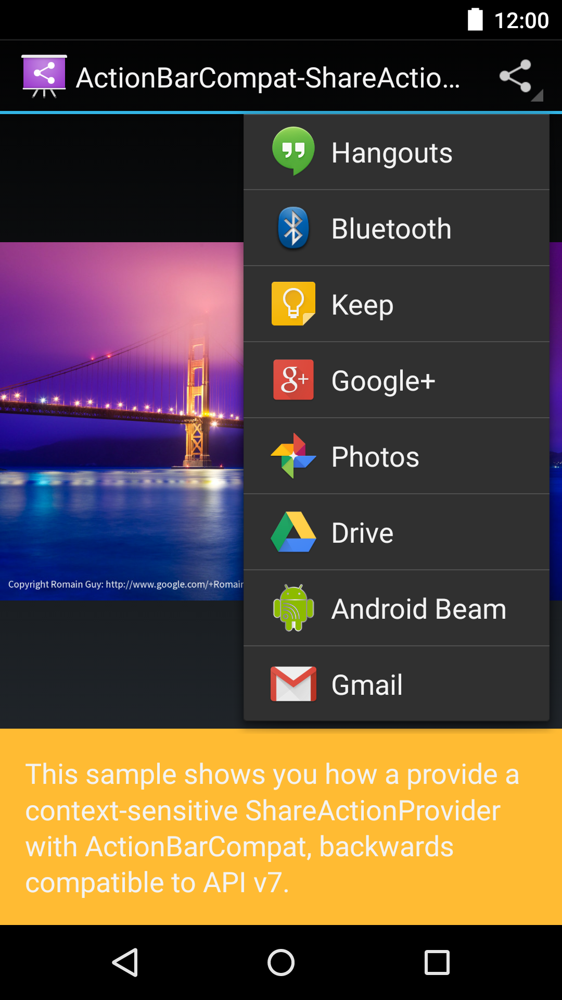
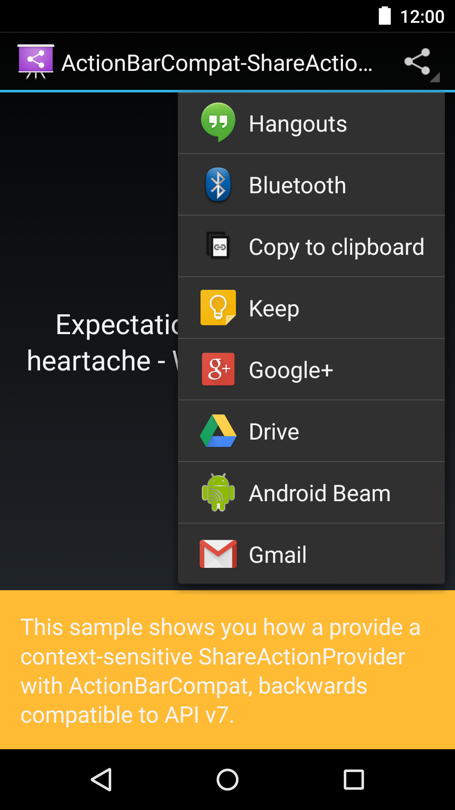

Android ActionBarCompat-ShareActionProvider Sample
===================================

This sample shows you how a provide a context-sensitive ShareActionProvider with
ActionBarCompat, backwards compatible to API v7.

Introduction
------------

The sample contains a [`ViewPager`][1] which displays content of differing types: image and
text. When a new item is selected in the ViewPager, the [`ShareActionProvider`][2] is updated with
a share intent specific to that content.

This Activity extends from [`ActionBarActivity`][3], which provides all of the function
necessary to display a compatible Action Bar on devices running Android v2.1+.

[1]: http://developer.android.com/reference/android/support/v4/view/ViewPager.html
[2]: http://developer.android.com/reference/android/widget/ShareActionProvider.html
[3]: https://developer.android.com/reference/android/support/v7/app/ActionBarActivity.html

Pre-requisites
--------------

- Android SDK 24
- Android Build Tools v24.0.1
- Android Support Repository

Screenshots
-------------

  

Getting Started
---------------

This sample uses the Gradle build system. To build this project, use the
"gradlew build" command or use "Import Project" in Android Studio.

Support
-------

- Google+ Community: https://plus.google.com/communities/105153134372062985968
- Stack Overflow: http://stackoverflow.com/questions/tagged/android

If you've found an error in this sample, please file an issue:
https://github.com/googlesamples/android-ActionBarCompat-ShareActionProvider

Patches are encouraged, and may be submitted by forking this project and
submitting a pull request through GitHub. Please see CONTRIBUTING.md for more details.

License
-------

Copyright 2016 The Android Open Source Project, Inc.

Licensed to the Apache Software Foundation (ASF) under one or more contributor
license agreements.  See the NOTICE file distributed with this work for
additional information regarding copyright ownership.  The ASF licenses this
file to you under the Apache License, Version 2.0 (the "License"); you may not
use this file except in compliance with the License.  You may obtain a copy of
the License at

http://www.apache.org/licenses/LICENSE-2.0

Unless required by applicable law or agreed to in writing, software
distributed under the License is distributed on an "AS IS" BASIS, WITHOUT
WARRANTIES OR CONDITIONS OF ANY KIND, either express or implied.  See the
License for the specific language governing permissions and limitations under
the License.
